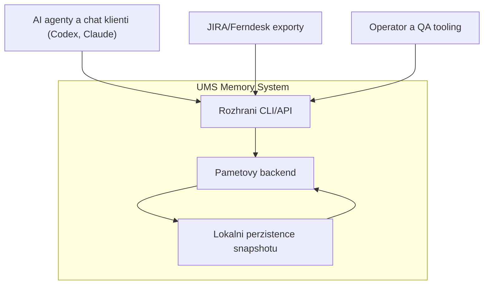
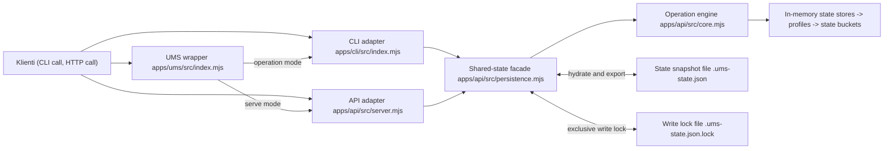
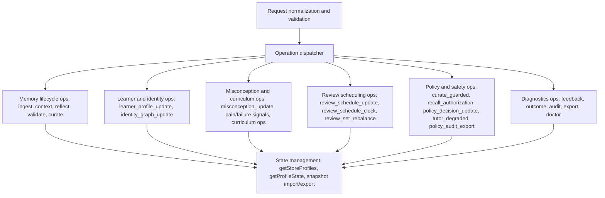
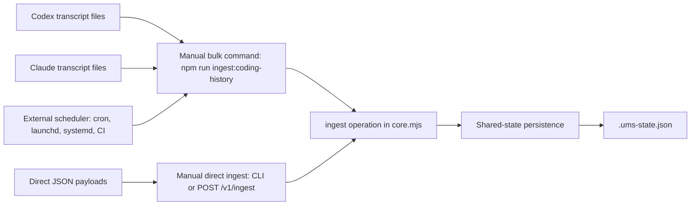

# UMS Architektonicky Diagram (as-is)

Cil: dat Jirkovi prehled struktury systemu, hranic zodpovednosti a mist, kde dava smysl navrhnout refaktor.

## 1) System Context (C4 L1)



## 2) Container Diagram (C4 L2, aktualni repo)



## 3) Backend Component Diagram (C4 L3, core.mjs)



## 4) Ingestion cesty: manualne vs automaticky



### Manualni ingest

1. Bulk import lokalni historie agentu:
```bash
npm run ingest:coding-history
```

2. Varianta s explicitnim store/profile/state:
```bash
npm run ingest:coding-history -- --store-id coding-agent --profile agent-history --state-file .ums-state.json
```

3. Primy ingest jedne udalosti pres CLI:
```bash
npm run cli -- ingest --store-id coding-agent --input '{"profile":"agent-history","events":[{"type":"note","source":"codex-cli","content":"example insight"}]}'
```

4. Primy ingest pres HTTP API:
```bash
curl -sS -X POST http://127.0.0.1:8787/v1/ingest \
  -H 'content-type: application/json' \
  -d '{"storeId":"coding-agent","profile":"agent-history","events":[{"type":"note","source":"claude-code","content":"example memory"}]}'
```

### Automaticky ingest (aktualni stav)

1. V repu neni vestaveny daemon, periodic worker ani filesystem trigger pro ingest.
2. Automatizace je aktualne "external orchestration": scheduler spousti stejny prikaz `npm run ingest:coding-history`.
3. Prakticky priklad (cron kazdych 30 minut):
```bash
*/30 * * * * cd /Users/satan/Developer/ums-memory && npm run ingest:coding-history -- --store-id coding-agent --profile agent-history >> /tmp/ums-ingest.log 2>&1
```
4. Ingest je navrzen replay-safe a deduplikuje duplicity; periodicke spousteni nevede k nekontrolovanemu rustu stejnych zaznamu.

## Co je dobre pro architekt review s Jirkou

1. `core.mjs` je aktualne monolit (dispatcher + domena + serializace stavu). Kandidat na rozdeleni do service modulu po domenach.
2. `persistence.mjs` resi lock i I/O, ale zatim pouze file snapshot. Otazka: jestli zavest repository vrstvu s vice backendy.
3. API i CLI jsou tenke adaptery nad stejnym enginem, to je plus. Otazka: kde oddelit stabilni kontrakt od interniho modelu.
4. Existuje paralelni engine `apps/api/src/ums/engine.mjs` (hlavne test/benchmark cesta). Otazka: sloucit, nebo drzet vedle sebe vedome.
5. Ingest orchestrace je mimo aplikaci (scheduler outside). Otazka: zustat u external scheduleru, nebo pridat interni ingest worker service.
